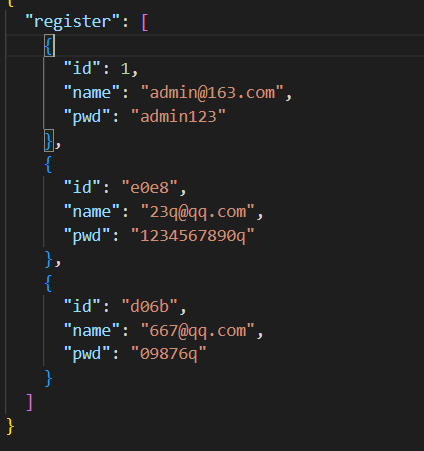
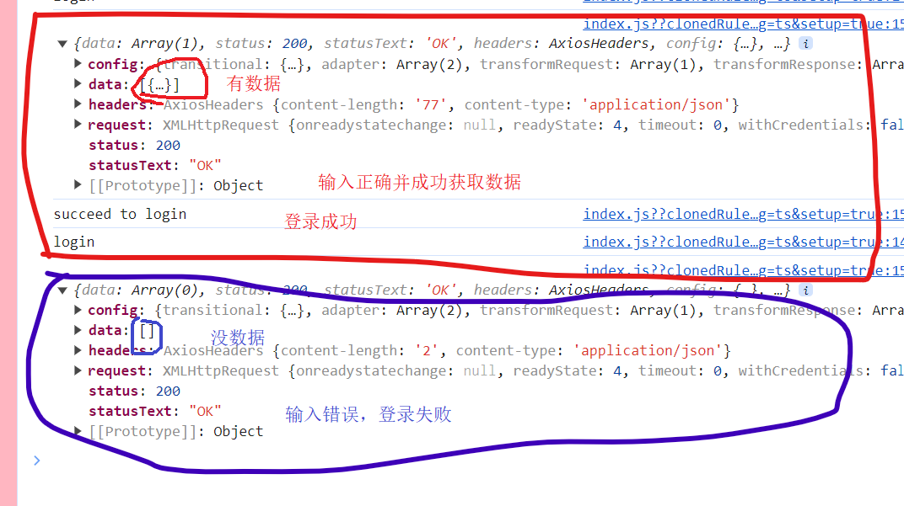
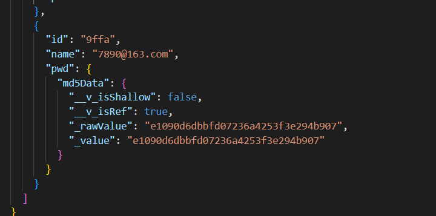

## vue_property_management project

## 一、项目环境搭建
* 1.1 步骤：
    * 1. 保证node版本在18.x以上
    * 2. 创建项目
        * ```vue create vue_property_management```
        * 选择默认的Vue2版本还是默认的Vue3版本中的哪一个，选择Manually select features-自定义，之后选择需要安装的配置项，选择TS、Router、Vuex、CSS Pre-processors；选择Vue3.x版本来搭建；之后就一直回车，选择默认的选项即可。
    * 3. 打开项目，在项目目录下，```npm run serve```，来启动项目
* 1.2 默认样式设置
    * 创建styles文件夹和styles文件夹下的styles.scss和main.scss文件，用于存放全局样式
* 1.4 安装引入，并使用elementplus，若网速过慢时，可以使用国内镜像，我在国外，没必要，又或者可以直接通过浏览器的 HTML 标签导入 Element Plus，在这里就不演示了
    * 1. 安装
        * ```npm install element-plus --save```
    * 2. 引入，完整引入会比较方便，但完整引入的话整个文件会变重，编译速度也会受影响，此时可以按需引入，按需引入就需要事先安装两个插件unplugin-vue-components 和 unplugin-auto-import，```npm install -D unplugin-vue-components unplugin-auto-import```，并向vue.config.js文件中添加plugins配置项。
        * ```
            完整
            // main.ts
            import { createApp } from 'vue'
            import ElementPlus from 'element-plus'
            import 'element-plus/dist/index.css'
            import App from './App.vue'

            createApp(App).use(ElementPlus).use(store).use(router).mount('#app')
            ...
            LoginView.vue
            <el-button type="primary" round>Primary</el-button>
          ```
        * ```
            按需
            vue.config.js
            const AutoImport = require('unplugin-auto-import/webpack')
            const Components = require('unplugin-vue-components/webpack')
            const { ElementPlusResolver } = require('unplugin-vue-components/resolvers')
            module.export=defineConfig({
                ...
                plugins: [
                    AutoImport({
                    resolvers: [ElementPlusResolver()],
                    }),
                    Components({
                    resolvers: [ElementPlusResolver()],
                    }),
                ],
            })
            ...
            LoginView.vue
            <el-button type="primary" round>Primary</el-button>
          ```

## 二、登录前准备
* 2.1 登录注册tab切换
    * 初始化数据，调用reactive函数来声明响应式数据，并赋值变量menuData，声明的数据是一个数组，包含关于注册和登录的两种不同状态的属性，在模板中用v-for遍历该数组并展示，在遍历数组的li标签里，声明一个点击事件，并为其绑定事件函数clickMenu，因为需要确定点击的到底是menuData中的哪一个对象，所以传个实参data，在执行clickMenu函数时，记得接收形参data(此时会报错，报参数data没有明确指定类型，写成data:any即可)。在clickMenu函数中遍历menuData，遍历的回调中，点击任何一个选项后，将所有的currentState变为false，然后紧接着将点击的currentState改为true。最后当点击登录或注册时，应有高亮，因此当currentState等于data.currentState时，周围样式发生改变
        * ```
            <div class="login">
                <div class="login-con">
                <ul class="menu-tab">
                    <!-- 遍历menuData，声明一个点击事件，并为其绑定事件函数，因需要确定点击的到底是数据中的哪一个传个实参data，当currentData为true时高亮 -->
                    <li v-for="data in menuData" :key="data.type" @click="clickMenu(data)" :class="{currentState:data.currentState}">
                    {{data.title}}
                    </li>
                </ul>
                </div>
            </div>

            <script lang="ts">
                import {reactive} from 'vue'
                export default {
                    name:'LoginView',
                    setup(){
                    // 初始化数据
                    const menuData=reactive([
                        {title:"登录",currentState:true,type:'login'},
                        {title:"注册",currentState:false,type:'register'},
                    ])

                    // 执行的函数中接收形参data
                    function clickMenu(data:any) {
                        // 数据循环
                        menuData.forEach(element=>{
                        // 点击任何一个选项后，将所有的currentState变为false，
                        element.currentState=false
                        })
                        // 然后紧接着将点击的currentState改为true
                        data.currentState=true
                    }

                    return {menuData,clickMenu}
                    }
                }
            </script>
            <style lang="scss">
                .login{
                    background: lightpink;
                    height:100%;
                }
                html,body,#app{
                    height:100%;
                }
                .menu-tab{
                    text-align: center;
                    li{
                    display: inline-block;
                    width:88px;
                    line-height: 36px;
                    font-size: 14px;
                    color: #fff;
                    border-radius: 2px;
                    cursor: pointer;
                    }
                    .currentState{
                    background: rgba(255,255,255,0.5);
                    }
                }
            </style>
          ```
* 2.2 引入表单模块
    * 在elementplus官网的Form表单中找到自定义校验规则，将代码复制粘贴到LoginView组件中，对其进行一些简单的修改，将输入框前的文字用label标签包裹，改为邮箱、密码和重复密码。用el-form标签里的demo-ruleForm样式名，统一表单内所有元素的宽度、和在这个页面中的位置。最后，将el-button中原先的Submit改为登录，并给添加一个class属性的样式login-btn和block，使按钮的宽度和上面的输入框的宽度保持一致。
        * ```
            <el-form-item prop="pass">
                <label>邮箱</label>
                <el-input v-model="ruleForm.pass" type="password" autocomplete="off" />
            </el-form-item>
            <el-form-item>
                <el-button type="primary" class="login-btn block" @click="submitForm(ruleFormRef)"
                    >登录</el-button>
            </el-form-item>
          ```
* 2.3 登录与注册Tab切换
    * 1. 当点击切换登录和注册tab时，也就是当触发clickMenu事件函数时，需要对页面的排版做出一些小改变，登录时不需要呈现重复密码，登录和注册进行切换时，最下方的按钮上文本也需要根据此发生改变，变成一样的登录或注册。
        * ```
            <!-- 登录选项时，不展示重复密码 -->
            <el-form-item prop="age" v-show="model==='register'">
                <label>重复密码</label>
                <el-input v-model.number="ruleForm.repassword" type="password"/>
            </el-form-item>
            <el-form-item>
                <el-button type="primary" class="login-btn block" @click="submitForm(ruleFormRef)">
                    <!-- 这里不能写死为登录，判断model值是否等于login，相等则展示登录，不相等则展示注册 -->
                    {{model==="login" ? '登录' : '注册'}}
                </el-button>
            </el-form-item>
            // 调用ref声明字符串的响应式数据
            let model=ref("login")
            function clickMenu(data:any){
                ...
                // 当点击任何一个选项时，将data中的type的属性值赋给model.value，使model.value的值随着点击发生改变
                model.value=data.type
            }
          ```
    * 2. 改变一下将从组件库中在赋值过来的el-form-item的一些属性的属性值。与邮箱的输入框双向绑定的pass改为username，密码的checkPass改为password，重复密码的age改为repassword，这些都是调用reactive声明的对象-ruleForm中初始化的属性，向ruleForm中添加username、password和repassword
        * ```
            <el-form-item prop="pass">
                <label>邮箱</label>
                <el-input v-model="ruleForm.username" type="text" autocomplete="off" />
            </el-form-item>
            <el-form-item prop="password">
                <label>密码</label>
                <el-input v-model="ruleForm.password" type="password" autocomplete="off"/>
            </el-form-item>
            <!-- 登录选项时，不展示重复密码 -->
            <el-form-item prop="age" v-show="model==='register'">
                <label>重复密码</label>
                <el-input v-model.number="ruleForm.repassword" type="password"/>
            </el-form-item>
            // 初始化密码，验证码，年龄的状态，添加username、password、repassword
            const ruleForm = reactive({
                username:'',
                password:'',
                repassword:'',
                pass: '',
                checkPass: '',
                age: '',
            })
          ```
* 2.4 elementplus表单验证
    * 使用正则校验邮箱、密码和重复密码，在再次校验密码的函数validatePass2中，设置登录时不进行重复密码的校验。并在调用reactive声明的rules中修改原先的属性名改为password、repassword和username。
        * ```
            // 在此设置以哪种方式触发表单验证，默认就是失去校验则验证
            const rules = reactive<FormRules<typeof ruleForm>>({
                password: [{ validator: validatePass, trigger: 'blur' }],
                repassword: [{ validator: validatePass2, trigger: 'blur' }],
                username: [{ validator: checkUser, trigger: 'blur' }],
            })
            // 检查邮箱
            function checkUser(rule: any, value: any, callback: any){
                // 创建邮箱正则来进行邮箱格式校验
                let reg = /^([a-zA-Z]|[0-9])(\w|\-)+@[a-zA-Z0-9]+\.([a-zA-Z]{2,4})$/; 
                if (!value) {
                    return callback(new Error('Please input the username'))
                }else if(!reg.test(value)){  //根据邮箱正则判断，若不符和判断条件，则提示错误
                    return callback(new Error('Username format is incorrect'))
                }else{
                    return callback()
                }
            }
            // 验证密码
            function validatePass (rule: any, value: any, callback: any) {
                let reg = /^(?!\D+$)(?![^a-zA-Z]+$)\S{6,15}$/;// 验证密码 6至15位的字母+数字 
                if (!value) {
                    callback(new Error('Please input the password'))
                } else if(!reg.test(value)){  //根据密码正则判断，若不符和判断条件，则提示错误
                    callback(new Error('Password format is wrong,it must contain 6-15 letters + numbers'))
                }else{
                    callback()
                }
            }
            // 再次验证密码
            function validatePass2 (rule: any, value: any, callback: any) {
                // 登录时没有重复密码的校验，所以在登录时取消重复密码的校验
                if (model.value==='login') {  // 若是在登录的选项tab，则无需校验，直接跳出
                    callback()
                }
                if (value === '') {
                    callback(new Error('Please input the password again'))
                } else if (value !== ruleForm.password) {
                    callback(new Error("Two inputs don't match!"))
                } else {
                    callback()
                }
            }
          ```
* 2.5 封装工具库
    * 创建utils文件夹，在其下创建verification.js文件，用于存放校验邮箱和密码时会执行的回调checkEmail和checkPassword，这两个函数接收形参，用于接收输入的数据，且都根据传递的数据的正确与否返回true或false，在组件当中，引入这两个函数，并作为判断条件调用。
        * ```
            verification.js
            export function checkEmail(data) {  //接收形参，用于接收输入的数据
                // 创建邮箱正则来进行邮箱格式校验
                let reg = /^([a-zA-Z]|[0-9])(\w|\-)+@[a-zA-Z0-9]+\.([a-zA-Z]{2,4})$/;
                // 判断若传递的数据为真，则返回true，否则返回false
                return !reg.test(data) ? true :false
            }

            export function checkPassword(data) {  //接收形参，用于接收输入的数据
                let reg = /^(?!\D+$)(?![^a-zA-Z]+$)\S{6,15}$/;// 验证密码 6至15位的字母+数字
                // 判断若传递的数据为真，则返回true，否则返回false
                return !reg.test(data) ? true : false
            }
            ...
            LoginView.vue
            // 引入两个工具函数
            import {checkEmail,checkPassword} from '../../utils/verification'
            ...
            // 检查邮箱
            function checkUser(rule: any, value: any, callback: any){
                if (!value) {
                    return callback(new Error('Please input the username'))
                }else if(checkEmail(value)){  // 判断条件为引入的checkEmail函数，checkEmail函数内使用了正则规定了邮箱格式
                    return callback(new Error('Username format is incorrect'))
                }else{
                    return callback()
                }
            }

            // 验证密码
            function validatePass (rule: any, value: any, callback: any) {
                if (!value) {
                    callback(new Error('Please input the password'))
                } else if(checkPassword(value)){  // 判断条件为引入的checkPassword函数，checkPassword函数内使用了正则规定了密码格式
                    callback(new Error('Password format is wrong,it must contain 6-15 letters + numbers'))
                }else{
                    callback()
                }
            }
          ```

## 三、封装
* 3.1 axios封装和拦截器--前台和后台之间的数据交互
    * Axios 是一个基于 promise 的 HTTP 库，可以用在浏览器和 node.js 中。需要调用axios的create方法来创建axios实例service，其次，调用service的拦截器的request和response的use方法来在请求或响应被 then 或 catch 处理前拦截它们。具体发送请求的函数，需要在创建的api文件夹下的link.js文件中进行，在link.js中引入service实例，并声明一个link函数，在函数中接收url、method、data、params为形参，发送请求时要用，函数内返回一个Promise实例对象，实例对象的异步函数中调用拦截器的request方法来发送请求，请求中发送url、method、data、params，其结果是一个promise对象，需要用then方法来解析，发送成功则调用resolve方法，来接收后台来的数据；发送失败则调用reject方法，来接收错误的信息。
        * ```
            service.js
            import axios from 'axios'
            // 创建axios实例
            const service=axios.create()

            // 请求拦截
            service.interceptors.request.use(function (config) {
                // Do something before request is sent
                return config;
            }, function (error) {
                // Do something with request error
                return Promise.reject(error);
            });

            // 响应拦截
            service.interceptors.response.use(function (response) {
                // Do something with response data
                return response;
            }, function (error) {
                // Do something with response error
                return Promise.reject(error);
            });
            export default service
            ...
            link.js
            import service from '../utils/service'  // 引入拦截器
            // 封装相关的数据请求

            // 声明link函数，接收url、method、data、params为形参，发送请求时要用
            let link=(url,method,data,params)=>{
                // 函数中返回一个Promise实例对象
                return new Promise((resolve,reject)=>{
                    // 调用拦截器的request方法来发送请求
                    service.request({
                        // url:url,  //可简写，下面的几个也一样
                        url,
                        method,
                        data,
                        params
                    }).then(value=>{
                        // 成功则调用resolve方法，来接收后台来的数据；
                        resolve(value)
                    }).catch(error=>{
                        // 失败则调用reject方法，来接收错误的信息
                        reject(error)
                    })
                })
            }
            export default link  // 最后暴露link函数，便于在组件中直接引入调用，并从后台获取数据
          ```
* 3.2 json-server
    * 通过json-server作为模拟数据，配合之前封装的数据请求(link.js)和url(url.js)，完成最基本的数据请求闭环，以后会陆续使用这种方式来实现数据请求的发送。在package.json设置json-server启动的配置别名mock，就可以在终端很方便地用```npm run mock```的方式启动，原先是在mock路径下，输入```json-server --watch ./src/mock/data.json --port 自定义端口号```来实现的。可以在组件中调用link函数来尝试是否能真的获取数据，需要提前配置好url.js文件，在其中设置获取数据的路径为启动json-server后得到的路径。
        * ```
            mock/data.json
            {
                "one":[
                    {"name":"EZ"},
                    {"name":"MF"},
                    {"name":"NOC"},
                    {"name":"VN"}
                ]
            }
            ...
            package.json
            "scripts": {
                ...
                "mock":"json-server --watch ./src/mock/data.json --port 8888"
            }
            ...
            api/url.js
            let apiUrl={
                one:"http://localhost:8888/one"
            }
            export default apiUrl
            ...
            LoginView.vue
            // 提交
            function submitForm (formEl: FormInstance | undefined) {
                if (!formEl) return
                formEl.validate((valid) => {
                if (valid) {
                    console.log('submit!')
                    // 这个位置是成功发送请求，完成登录或注册的位置，尝试获取json-server的数据
                    // 因为调用link函数返回的是一个promise对象，所以需要调用promise对象的then方法来解析获取数据
                    link(apiUrl.one).then(value=>{
                        console.log(value);
                    })
                } else {
                    console.log('error submit!')
                    return false
                }
                })
            }
          ```
* 3.3 Vue环境部署与baseURL配置
    * 在根路径下创建.env.development和.env.production，在其中可以创建随机的变量文件，这个变量，可以根据不同的环境下，自动切换。将数据请求的地址，配置到了不同模式的环境变量当中，然后再在拦截器文件-service中，给axios的baseUrl设置默认请求路径，然后可以根据不同的环境，读取不同请求地址中的数据，从而在url封装之后，只封装在url.js文件中基本的路由地址，以达到根据不同的环境，进行动态的切换。但根据我目前代码和环境的情况，url.js中基本路由地址不能简写，因为我在组件当中无法获取到目前的开发环境，不写完整回调到奇怪的地方获取数据，当然后果是无法得到任何数据
        * ```
            .env.development
            Vue_APP_API="http://localhost:8888"  #开发环境地址可以放这里
            ...
            service.js
            // 声明axiosUrl为空字符串
            let axiosUrl=''

            // 判断条件为目前是否为development环境
            if(process.env.NODE_ENV==="development"){
                // 是则，使axiosURL的值为先前在.env.development文件中设置的获取数据的路径
                axiosUrl=process.env.Vue_APP_API
            }else{
                // 否则，使axiosURL的值为其他的获取数据的路径
                axiosUrl=process.env.Vue_APP_API
            }

            // 创建axios实例
            const service=axios.create({
                baseUrl:axiosUrl  // 声明默认请求地址
            })
            ...
            LoginView.vue
            // 提交
            const submitForm=(formEl: FormInstance | undefined)=>{
                if (!formEl) return
                formEl.validate((valid) => {
                if (valid) {
                    console.log('submit!')
                    // 这个位置是成功发送请求，完成登录或注册的位置，尝试获取json-server的数据
                    // 因为调用link函数返回的是一个promise对象，所以需要调用promise对象的then方法来解析获取数据
                    link(apiUrl.one).then((value:any)=>{
                    console.log(value);
                    
                    })
                } else {
                    console.log('error submit!')
                    return false
                }
                })
            }
          ```
* 3.4 注册功能实现
    * 输入正确规格的邮箱和密码，点击注册按钮后跳转到登录部分，并提示成功注册的提示框。值得注意的是，每次注册时输入的邮箱和密码，都可以在data.json文件中查看到，因为注册时调用link函数时，method时POST，所以这一步是向数据库当中传递/添加用户的数据，以便于在之后登陆时从数据库中获取数据，以实现登录，跳转到主页面，以及在主页面展示用户名。注册成功与否时需要弹出的提示框，在element-plus官网中引入调用。
        * ```
            LoginView.vue
            // 注册时调用的该函数参数是apiUrl.register，"POST",data
            link(apiUrl.register,"POST",data).then((value:any)=>{
                // 判断，若成功传递数据了，则将data转换为数组时，长度就不是0
                if (Object.keys(value.data).length !== 0) {
                // 输入邮箱密码注册成功后，就可以跳到登录部分；
                ElMessage({
                    showClose: true,
                    message: 'Congrats, this is a success message.',
                    type: 'success',
                })
                model.value="login"
                // 遍历menuData
                menuData.forEach(menudata=>{
                    // 将其中currentState属性的值全部改为false
                    menudata.currentState=false
                })
                // 全部改为false后，将menuData数组里第一个元素的，也就是登录的currentState改为true
                menuData[0].currentState=true
                } else {
                // 若注册失败，则给用户一个失败了的提示
                ElMessage({
                    showClose: true,
                    message: 'Oops, this is a error message.',
                    type: 'error',
                })
                }
            })
          ```
        * 
* 3.5 响应拦截器
    * 在响应拦截器中，若接收到失败的请求返回结果后，不会立即展示错误的信息，需要先对其返回的状态码进行一些处理，再提示用户出现了哪些错误，以便于用户可以正确了解错误。想要提示用户也可以不像下面代码里一样用alert，也可以从element-plus中引入、调用ElMessage()来提示。
        * ```
            // 响应拦截，在接收到响应的时候，进行一些操作
            service.interceptors.response.use(function (response) {
                // Do something with response data
                return response;
            }, function (error) {
                // 在接收到请求返回结果时，先不显示错误的信息，先对响应的状态码进行一些处理，给用户错误的提示信息
                console.log('error:',error.response.status);  // error:404
                // 拦截到错误信息时，在此可以判断错误状态代码来输出错误信息来提醒用户
                switch (error.response.status) {
                    case 404:
                        alert('The current path is wrong!!')
                        break;
                    case 500:
                        alert('Failed to connect with server, please try again later!!')
                    break;
                
                    default:
                        alert('Unknown error!!')
                        break;
                }
                // Do something with response error
                return Promise.reject(error);
            });
          ```

## 四、 登录模块
* 4.1 实现登录功能
    * 首先，给登录/注册按钮添加disabled属性，属性值为变量btnbool，disabled属性用v-bind进行单向绑定。调用ref声明响应式数据btnbool，其默认值设置为true，其值为true时就不允许点击登录/注册按钮进行下一步操作。
    * 其次，调用watch来监测ruleForm内所有属性，在watch指定的回调内进行判断，若是登录，则再判断，若邮箱-newValue.username和密码-newValue.password输入框都有值，才可以点击登录，将btnbool的值改为false，但凡有一个没有值btnbool的值还是true；若是注册的状态，邮箱、密码、再次输入密码的输入框都要有值，才可以注册，否则btnbool为true。
    * 最后，在提交的方法中的判断条件为valid判断中，再设置一个判断，判断点击的是登录按钮还是注册按钮，若为登录，则调用link函数，这次的请求方法为GET，且想要获取的就是之前输入到name和pwd两个输入框里的值，若成功获取正确的值，则可以调用ElMessage来提示登录成功，反之，输错密码或邮箱，则提示登录失败。
        * ```
            <el-button  :disabled="btnbool" type="primary"  class="login-btn block"  @click="submitForm(ruleFormRef)">
                {{model==="login" ? '登录' : '注册'}}
            </el-button>
            ...
            // 声明ref创建的响应式数据btnbool，默认值设置为true，为true时就不允许点击登录按钮进行登录操作
            let btnbool=ref(true)
            // 监测ruleForm内所有属性
            watch(ruleForm,(newValue)=>{
                // 判断到底是登录还是注册，若为登录
                if (model.value==='login') {
                // 若邮箱和密码输入框不是空，两个输入框都有值，才可以点击登录按钮，成功登录跳到其他路由，
                if(newValue.username!==""&&newValue.password!==''){
                    // 则将btnbool的值改为false，使登录按钮能够被点击并进行登录操作；
                    btnbool.value=false
                }else{
                    // 否则btnbool的值还是true
                    btnbool.value=true
                }
                } else {  // 若为注册，
                    // 若邮箱和密码、再次输入密码输入框不是空，三个输入框都有值，才可以点击注册按钮，成功跳到登录部分，
                    if(newValue.username!==""&&newValue.password!==''&&newValue.repassword!==''){
                        // 则将btnbool的值改为false，使注册按钮能够被点击并进行注册操作；
                        btnbool.value=false
                    }else{
                        // 否则btnbool的值还是true
                        btnbool.value=true
                    }
                }
            })
            ...
            // 在此判断点击的是登录还是注册时的按钮
            if (model.value==="login") {
            console.log("login")
            // 若是登录，向apiUrl中定义的地址中，发送get请求，想要获取的就是输入到两个输入框里的值
            link(apiUrl.register,"GET",{},{name:ruleForm.username,pwd:ruleForm.password}).then((value:any)=>{
                // 若从apiUrl定义的地址中获取的数据的data长度不是0，也就是成功获取正确的数据，则登录成功，
                if (value.data.length!=0) {
                console.log('succeed to login');
                ElMessage({
                    showClose: true,
                    message: 'Succeed to login.',
                    type: 'success',
                })
                }else{
                // 反之，因输错密码或邮箱获取的数据长度为0，则登录失败
                console.log('failed to login');
                ElMessage({
                    showClose: true,
                    message: 'Oops, failed to login.',
                    type: 'error',
                })
                }
            })
            }
          ```
        * 
* 4.2 自定义hook封装加密
    * 1. 介绍js-md5
        * 是通过前台js加密的方式对密码等私密信息进行加密的工具。
        * 好处：
            * (1). 用js对私密信息加密可避免在网络中传输明文信息,被人截取数据包而造成数据泄露。
            * (2). 避免缓存中自动缓存密码。使用谷歌浏览器登录时，输入的用户名或密码会自动缓存，在此登录时，无需再次输入密码即可登陆，这样容易泄露密码，使用js加密时,缓存的加密后的密文,用密文做密码登陆是不成功的,即使泄露也是泄露的密文,对密码不会造成威胁，缺点是每次登陆时都要手动输入密码，较麻烦。
            * (3). 减少服务器加密时的资源消耗。从理论上提高了服务器的性能。
        * 安装： npm i -D js-md5
    * 2. 如何加密
        * 安装js-md5后，在hooks文件夹中创建useMd5 hook，在useMd5中接收一个data形参，函数内将接收到的参数data(也就是密码)，用md5方法进行转换加密，又调用ref函数来声明为响应式数据。回到LoginView组件当中，因为密码需要被加密，在注册的部分，将data的pwd属性值改为useMd5(ruleForm.password).value，同样登录时，需要个数据库进行比对的pwd属性也需要改为useMd5(ruleForm.password).value，此时到mock/data.json中可以查看到，与之前注册时不同，pwd被加密了。
            * ```
                /hooks/useMd5.js
                import md5 from 'js-md5'
                import {ref} from 'vue'

                export default function useMd5 (data){
                    // 将接收到的参数data(也就是密码)，用md5方法进行转换加密，又调用ref函数来声明为响应式数据
                    let md5Data=ref(md5(data))

                    return{md5Data}
                }
                ...
                LoginView.js
                // 在此判断点击的是登录还是注册时的按钮
                if (model.value==="login") {
                // 若是登录，向apiUrl中定义的地址中，发送get请求，想要获取的就是输入到两个输入框里的值，并将需要比对的密码加密
                link(apiUrl.register,"GET",{},{name:ruleForm.username,pwd:useMd5(ruleForm.password).value}).then((value:any)=>{
                    // 若从apiUrl定义的地址中获取的数据的data长度不是0，也就是成功获取正确的数据，则登录成功，
                    if (value.data.length!=0) {
                    console.log('succeed to login');
                    ElMessage({
                        showClose: true,
                        message: 'Succeed to login.',
                        type: 'success',
                    })
                    }else{
                    // 反之，因输错密码或邮箱获取的数据长度为0，则登录失败
                    console.log('failed to login');
                    ElMessage({
                        showClose: true,
                        message: 'Oops, failed to login.',
                        type: 'error',
                    })
                    }
                })
                }else{
                    // 需要作为参数传递的数据，是注册时要用的，是传递到服务器的数据
                    let data={
                        // name属性的值为与el-input双向绑定的ruleForm.username
                        name:ruleForm.username,
                        // pwd属性的值为与el-input双向绑定的ruleForm.password
                        // pwd:ruleForm.password
                        // 对密码进行加密，调用useMd5函数
                        pwd:useMd5(ruleForm.password).value
                    }
                    // 这个位置是成功发送请求，完成登录或注册的位置，尝试获取json-server的数据
                    // 因为调用link函数返回的是一个promise对象，所以需要调用promise对象的then方法来解析获取数据
                    // 注册时调用的该函数参数是apiUrl.register，"POST",data
                    link(apiUrl.register,"POST",data).then((value:any)=>{
                        // 判断，若成功传递数据了，则将data转换为数组时，长度就不是0
                        if (Object.keys(value.data).length !== 0) {
                            // 输入邮箱密码注册成功后，就可以跳到登录部分；
                            ElMessage({
                                showClose: true,
                                message: 'Congrats, this is a success message.',
                                type: 'success',
                            })
                            model.value="login"
                            // 遍历menuData
                            menuData.forEach(menudata=>{
                                // 将其中currentState属性的值全部改为false
                                menudata.currentState=false
                            })
                            // 全部改为false后，将menuData数组里第一个元素的，也就是登录的currentState改为true
                            menuData[0].currentState=true
                        } else {
                            // 若注册失败，则给用户一个失败了的提示
                            ElMessage({
                                showClose: true,
                                message: 'Oops, this is a error message.',
                                type: 'error',
                            })
                        }
                    })
                }
              ```
            * 
* 4.3 useRouter导航
    * 使用useRouter导航，在登陆成功后，跳转到主页面的操作。vue3配合使用的vue-router4当中不允许使用this来代表Vue实例对象，也就是不允许使用this，要实现路由跳转，需要从vue-router中引入useRouter hook，调用useRouter声明router函数，在登录成功的判断，也就是用户没有输错邮箱和密码并点击登录按钮，成功登录时，自动跳转到首页页面。记得事先在路由配置文件中配置好home的路由
        * ```
            router/index.ts
            // 配置home路由
            {
                path: '/home',  
                name: 'home',
            
                component: () => import('../views/home/HomeView.vue')
            },
            // 路由重定向，默认跳转至login
            {
                path:"/",
                redirect:"/login"
            }
            ...
            LoginView.vue
            // 引入vue-router
            import {useRouter} from 'vue-router'
            let router=useRouter()  // 调用useRouter声明router函数
            // 调用router的push方法实现路由跳转
            router.push("/home")
          ```

## 五、首页模块
* 5.1 