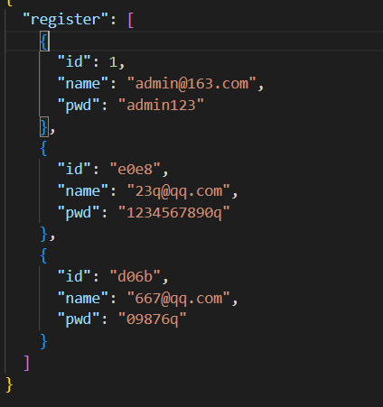
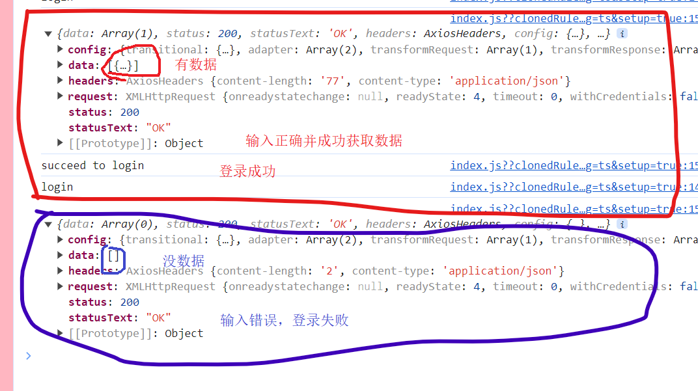
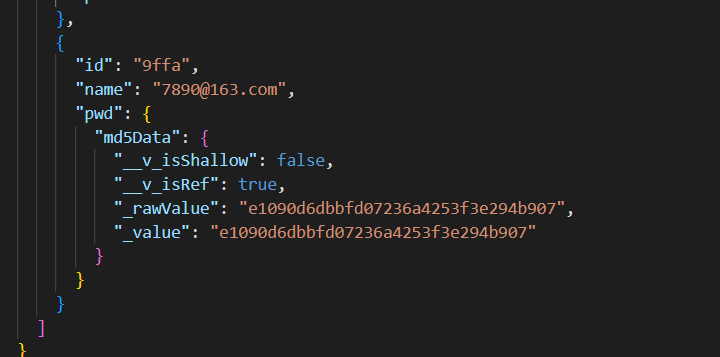

## vue_property_management project

## 一、项目环境搭建
* 1.1 步骤：
    * 1. 保证node版本在18.x以上
    * 2. 创建项目
        * ```vue create vue_property_management```
        * 选择默认的Vue2版本还是默认的Vue3版本中的哪一个，选择Manually select features-自定义，之后选择需要安装的配置项，选择TS、Router、Vuex、CSS Pre-processors；选择Vue3.x版本来搭建；之后就一直回车，选择默认的选项即可。
    * 3. 打开项目，在项目目录下，```npm run serve```，来启动项目
* 1.2 默认样式设置
    * 创建styles文件夹和styles文件夹下的styles.scss和main.scss文件，用于存放全局样式
* 1.4 安装引入，并使用elementplus，若网速过慢时，可以使用国内镜像，我在国外，没必要，又或者可以直接通过浏览器的 HTML 标签导入 Element Plus，在这里就不演示了
    * 1. 安装
        * ```npm install element-plus --save```
    * 2. 引入，完整引入会比较方便，但完整引入的话整个文件会变重，编译速度也会受影响，此时可以按需引入，按需引入就需要事先安装两个插件unplugin-vue-components 和 unplugin-auto-import，```npm install -D unplugin-vue-components unplugin-auto-import```，并向vue.config.js文件中添加plugins配置项。
        * ```
            完整
            // main.ts
            import { createApp } from 'vue'
            import ElementPlus from 'element-plus'
            import 'element-plus/dist/index.css'
            import App from './App.vue'

            createApp(App).use(ElementPlus).use(store).use(router).mount('#app')
            ...
            LoginView.vue
            <el-button type="primary" round>Primary</el-button>
          ```
        * ```
            按需
            vue.config.js
            const AutoImport = require('unplugin-auto-import/webpack')
            const Components = require('unplugin-vue-components/webpack')
            const { ElementPlusResolver } = require('unplugin-vue-components/resolvers')
            module.export=defineConfig({
                ...
                plugins: [
                    AutoImport({
                    resolvers: [ElementPlusResolver()],
                    }),
                    Components({
                    resolvers: [ElementPlusResolver()],
                    }),
                ],
            })
            ...
            LoginView.vue
            <el-button type="primary" round>Primary</el-button>
          ```

## 二、登录前准备
* 2.1 登录注册tab切换
    * 初始化数据，调用reactive函数来声明响应式数据，并赋值变量menuData，声明的数据是一个数组，包含关于注册和登录的两种不同状态的属性，在模板中用v-for遍历该数组并展示，在遍历数组的li标签里，声明一个点击事件，并为其绑定事件函数clickMenu，因为需要确定点击的到底是menuData中的哪一个对象，所以传个实参data，在执行clickMenu函数时，记得接收形参data(此时会报错，报参数data没有明确指定类型，写成data:any即可)。在clickMenu函数中遍历menuData，遍历的回调中，点击任何一个选项后，将所有的currentState变为false，然后紧接着将点击的currentState改为true。最后当点击登录或注册时，应有高亮，因此当currentState等于data.currentState时，周围样式发生改变
        * ```
            <div class="login">
                <div class="login-con">
                <ul class="menu-tab">
                    <!-- 遍历menuData，声明一个点击事件，并为其绑定事件函数，因需要确定点击的到底是数据中的哪一个传个实参data，当currentData为true时高亮 -->
                    <li v-for="data in menuData" :key="data.type" @click="clickMenu(data)" :class="{currentState:data.currentState}">
                    {{data.title}}
                    </li>
                </ul>
                </div>
            </div>

            <script lang="ts">
                import {reactive} from 'vue'
                export default {
                    name:'LoginView',
                    setup(){
                    // 初始化数据
                    const menuData=reactive([
                        {title:"登录",currentState:true,type:'login'},
                        {title:"注册",currentState:false,type:'register'},
                    ])

                    // 执行的函数中接收形参data
                    function clickMenu(data:any) {
                        // 数据循环
                        menuData.forEach(element=>{
                        // 点击任何一个选项后，将所有的currentState变为false，
                        element.currentState=false
                        })
                        // 然后紧接着将点击的currentState改为true
                        data.currentState=true
                    }

                    return {menuData,clickMenu}
                    }
                }
            </script>
            <style lang="scss">
                .login{
                    background: lightpink;
                    height:100%;
                }
                html,body,#app{
                    height:100%;
                }
                .menu-tab{
                    text-align: center;
                    li{
                    display: inline-block;
                    width:88px;
                    line-height: 36px;
                    font-size: 14px;
                    color: #fff;
                    border-radius: 2px;
                    cursor: pointer;
                    }
                    .currentState{
                    background: rgba(255,255,255,0.5);
                    }
                }
            </style>
          ```
* 2.2 引入表单模块
    * 在elementplus官网的Form表单中找到自定义校验规则，将代码复制粘贴到LoginView组件中，对其进行一些简单的修改，将输入框前的文字用label标签包裹，改为邮箱、密码和重复密码。用el-form标签里的demo-ruleForm样式名，统一表单内所有元素的宽度、和在这个页面中的位置。最后，将el-button中原先的Submit改为登录，并给添加一个class属性的样式login-btn和block，使按钮的宽度和上面的输入框的宽度保持一致。
        * ```
            <el-form-item prop="pass">
                <label>邮箱</label>
                <el-input v-model="ruleForm.pass" type="password" autocomplete="off" />
            </el-form-item>
            <el-form-item>
                <el-button type="primary" class="login-btn block" @click="submitForm(ruleFormRef)"
                    >登录</el-button>
            </el-form-item>
          ```
* 2.3 登录与注册Tab切换
    * 1. 当点击切换登录和注册tab时，也就是当触发clickMenu事件函数时，需要对页面的排版做出一些小改变，登录时不需要呈现重复密码，登录和注册进行切换时，最下方的按钮上文本也需要根据此发生改变，变成一样的登录或注册。
        * ```
            <!-- 登录选项时，不展示重复密码 -->
            <el-form-item prop="age" v-show="model==='register'">
                <label>重复密码</label>
                <el-input v-model.number="ruleForm.repassword" type="password"/>
            </el-form-item>
            <el-form-item>
                <el-button type="primary" class="login-btn block" @click="submitForm(ruleFormRef)">
                    <!-- 这里不能写死为登录，判断model值是否等于login，相等则展示登录，不相等则展示注册 -->
                    {{model==="login" ? '登录' : '注册'}}
                </el-button>
            </el-form-item>
            // 调用ref声明字符串的响应式数据
            let model=ref("login")
            function clickMenu(data:any){
                ...
                // 当点击任何一个选项时，将data中的type的属性值赋给model.value，使model.value的值随着点击发生改变
                model.value=data.type
            }
          ```
    * 2. 改变一下将从组件库中在赋值过来的el-form-item的一些属性的属性值。与邮箱的输入框双向绑定的pass改为username，密码的checkPass改为password，重复密码的age改为repassword，这些都是调用reactive声明的对象-ruleForm中初始化的属性，向ruleForm中添加username、password和repassword
        * ```
            <el-form-item prop="pass">
                <label>邮箱</label>
                <el-input v-model="ruleForm.username" type="text" autocomplete="off" />
            </el-form-item>
            <el-form-item prop="password">
                <label>密码</label>
                <el-input v-model="ruleForm.password" type="password" autocomplete="off"/>
            </el-form-item>
            <!-- 登录选项时，不展示重复密码 -->
            <el-form-item prop="age" v-show="model==='register'">
                <label>重复密码</label>
                <el-input v-model.number="ruleForm.repassword" type="password"/>
            </el-form-item>
            // 初始化密码，验证码，年龄的状态，添加username、password、repassword
            const ruleForm = reactive({
                username:'',
                password:'',
                repassword:'',
                pass: '',
                checkPass: '',
                age: '',
            })
          ```
* 2.4 elementplus表单验证
    * 使用正则校验邮箱、密码和重复密码，在再次校验密码的函数validatePass2中，设置登录时不进行重复密码的校验。并在调用reactive声明的rules中修改原先的属性名改为password、repassword和username。
        * ```
            // 在此设置以哪种方式触发表单验证，默认就是失去校验则验证
            const rules = reactive<FormRules<typeof ruleForm>>({
                password: [{ validator: validatePass, trigger: 'blur' }],
                repassword: [{ validator: validatePass2, trigger: 'blur' }],
                username: [{ validator: checkUser, trigger: 'blur' }],
            })
            // 检查邮箱
            function checkUser(rule: any, value: any, callback: any){
                // 创建邮箱正则来进行邮箱格式校验
                let reg = /^([a-zA-Z]|[0-9])(\w|\-)+@[a-zA-Z0-9]+\.([a-zA-Z]{2,4})$/; 
                if (!value) {
                    return callback(new Error('Please input the username'))
                }else if(!reg.test(value)){  //根据邮箱正则判断，若不符和判断条件，则提示错误
                    return callback(new Error('Username format is incorrect'))
                }else{
                    return callback()
                }
            }
            // 验证密码
            function validatePass (rule: any, value: any, callback: any) {
                let reg = /^(?!\D+$)(?![^a-zA-Z]+$)\S{6,15}$/;// 验证密码 6至15位的字母+数字 
                if (!value) {
                    callback(new Error('Please input the password'))
                } else if(!reg.test(value)){  //根据密码正则判断，若不符和判断条件，则提示错误
                    callback(new Error('Password format is wrong,it must contain 6-15 letters + numbers'))
                }else{
                    callback()
                }
            }
            // 再次验证密码
            function validatePass2 (rule: any, value: any, callback: any) {
                // 登录时没有重复密码的校验，所以在登录时取消重复密码的校验
                if (model.value==='login') {  // 若是在登录的选项tab，则无需校验，直接跳出
                    callback()
                }
                if (value === '') {
                    callback(new Error('Please input the password again'))
                } else if (value !== ruleForm.password) {
                    callback(new Error("Two inputs don't match!"))
                } else {
                    callback()
                }
            }
          ```
* 2.5 封装工具库
    * 创建utils文件夹，在其下创建verification.js文件，用于存放校验邮箱和密码时会执行的回调checkEmail和checkPassword，这两个函数接收形参，用于接收输入的数据，且都根据传递的数据的正确与否返回true或false，在组件当中，引入这两个函数，并作为判断条件调用。
        * ```
            verification.js
            export function checkEmail(data) {  //接收形参，用于接收输入的数据
                // 创建邮箱正则来进行邮箱格式校验
                let reg = /^([a-zA-Z]|[0-9])(\w|\-)+@[a-zA-Z0-9]+\.([a-zA-Z]{2,4})$/;
                // 判断若传递的数据为真，则返回true，否则返回false
                return !reg.test(data) ? true :false
            }

            export function checkPassword(data) {  //接收形参，用于接收输入的数据
                let reg = /^(?!\D+$)(?![^a-zA-Z]+$)\S{6,15}$/;// 验证密码 6至15位的字母+数字
                // 判断若传递的数据为真，则返回true，否则返回false
                return !reg.test(data) ? true : false
            }
            ...
            LoginView.vue
            // 引入两个工具函数
            import {checkEmail,checkPassword} from '../../utils/verification'
            ...
            // 检查邮箱
            function checkUser(rule: any, value: any, callback: any){
                if (!value) {
                    return callback(new Error('Please input the username'))
                }else if(checkEmail(value)){  // 判断条件为引入的checkEmail函数，checkEmail函数内使用了正则规定了邮箱格式
                    return callback(new Error('Username format is incorrect'))
                }else{
                    return callback()
                }
            }

            // 验证密码
            function validatePass (rule: any, value: any, callback: any) {
                if (!value) {
                    callback(new Error('Please input the password'))
                } else if(checkPassword(value)){  // 判断条件为引入的checkPassword函数，checkPassword函数内使用了正则规定了密码格式
                    callback(new Error('Password format is wrong,it must contain 6-15 letters + numbers'))
                }else{
                    callback()
                }
            }
          ```

## 三、封装
* 3.1 axios封装和拦截器--前台和后台之间的数据交互
    * Axios 是一个基于 promise 的 HTTP 库，可以用在浏览器和 node.js 中。需要调用axios的create方法来创建axios实例service，其次，调用service的拦截器的request和response的use方法来在请求或响应被 then 或 catch 处理前拦截它们。具体发送请求的函数，需要在创建的api文件夹下的link.js文件中进行，在link.js中引入service实例，并声明一个link函数，在函数中接收url、method、data、params为形参，发送请求时要用，函数内返回一个Promise实例对象，实例对象的异步函数中调用拦截器的request方法来发送请求，请求中发送url、method、data、params，其结果是一个promise对象，需要用then方法来解析，发送成功则调用resolve方法，来接收后台来的数据；发送失败则调用reject方法，来接收错误的信息。
        * ```
            service.js
            import axios from 'axios'
            // 创建axios实例
            const service=axios.create()

            // 请求拦截
            service.interceptors.request.use(function (config) {
                // Do something before request is sent
                return config;
            }, function (error) {
                // Do something with request error
                return Promise.reject(error);
            });

            // 响应拦截
            service.interceptors.response.use(function (response) {
                // Do something with response data
                return response;
            }, function (error) {
                // Do something with response error
                return Promise.reject(error);
            });
            export default service
            ...
            link.js
            import service from '../utils/service'  // 引入拦截器
            // 封装相关的数据请求

            // 声明link函数，接收url、method、data、params为形参，发送请求时要用
            let link=(url,method,data,params)=>{
                // 函数中返回一个Promise实例对象
                return new Promise((resolve,reject)=>{
                    // 调用拦截器的request方法来发送请求
                    service.request({
                        // url:url,  //可简写，下面的几个也一样
                        url,
                        method,
                        data,
                        params
                    }).then(value=>{
                        // 成功则调用resolve方法，来接收后台来的数据；
                        resolve(value)
                    }).catch(error=>{
                        // 失败则调用reject方法，来接收错误的信息
                        reject(error)
                    })
                })
            }
            export default link  // 最后暴露link函数，便于在组件中直接引入调用，并从后台获取数据
          ```
* 3.2 json-server
    * 通过json-server作为模拟数据，配合之前封装的数据请求(link.js)和url(url.js)，完成最基本的数据请求闭环，以后会陆续使用这种方式来实现数据请求的发送。在package.json设置json-server启动的配置别名mock，就可以在终端很方便地用```npm run mock```的方式启动，原先是在mock路径下，输入```json-server --watch ./src/mock/data.json --port 自定义端口号```来实现的。可以在组件中调用link函数来尝试是否能真的获取数据，需要提前配置好url.js文件，在其中设置获取数据的路径为启动json-server后得到的路径。
        * ```
            mock/data.json
            {
                "one":[
                    {"name":"EZ"},
                    {"name":"MF"},
                    {"name":"NOC"},
                    {"name":"VN"}
                ]
            }
            ...
            package.json
            "scripts": {
                ...
                "mock":"json-server --watch ./src/mock/data.json --port 8888"
            }
            ...
            api/url.js
            let apiUrl={
                one:"http://localhost:8888/one"
            }
            export default apiUrl
            ...
            LoginView.vue
            // 提交
            function submitForm (formEl: FormInstance | undefined) {
                if (!formEl) return
                formEl.validate((valid) => {
                if (valid) {
                    console.log('submit!')
                    // 这个位置是成功发送请求，完成登录或注册的位置，尝试获取json-server的数据
                    // 因为调用link函数返回的是一个promise对象，所以需要调用promise对象的then方法来解析获取数据
                    link(apiUrl.one).then(value=>{
                        console.log(value);
                    })
                } else {
                    console.log('error submit!')
                    return false
                }
                })
            }
          ```
* 3.3 Vue环境部署与baseURL配置
    * 在根路径下创建.env.development和.env.production，在其中可以创建随机的变量文件，这个变量，可以根据不同的环境下，自动切换。将数据请求的地址，配置到了不同模式的环境变量当中，然后再在拦截器文件-service中，给axios的baseUrl设置默认请求路径，然后可以根据不同的环境，读取不同请求地址中的数据，从而在url封装之后，只封装在url.js文件中基本的路由地址，以达到根据不同的环境，进行动态的切换。但根据我目前代码和环境的情况，url.js中基本路由地址不能简写，因为我在组件当中无法获取到目前的开发环境，不写完整回调到奇怪的地方获取数据，当然后果是无法得到任何数据
        * ```
            .env.development
            Vue_APP_API="http://localhost:8888"  #开发环境地址可以放这里
            ...
            service.js
            // 声明axiosUrl为空字符串
            let axiosUrl=''

            // 判断条件为目前是否为development环境
            if(process.env.NODE_ENV==="development"){
                // 是则，使axiosURL的值为先前在.env.development文件中设置的获取数据的路径
                axiosUrl=process.env.Vue_APP_API
            }else{
                // 否则，使axiosURL的值为其他的获取数据的路径
                axiosUrl=process.env.Vue_APP_API
            }

            // 创建axios实例
            const service=axios.create({
                baseUrl:axiosUrl  // 声明默认请求地址
            })
            ...
            LoginView.vue
            // 提交
            const submitForm=(formEl: FormInstance | undefined)=>{
                if (!formEl) return
                formEl.validate((valid) => {
                if (valid) {
                    console.log('submit!')
                    // 这个位置是成功发送请求，完成登录或注册的位置，尝试获取json-server的数据
                    // 因为调用link函数返回的是一个promise对象，所以需要调用promise对象的then方法来解析获取数据
                    link(apiUrl.one).then((value:any)=>{
                    console.log(value);
                    
                    })
                } else {
                    console.log('error submit!')
                    return false
                }
                })
            }
          ```
* 3.4 注册功能实现
    * 输入正确规格的邮箱和密码，点击注册按钮后跳转到登录部分，并提示成功注册的提示框。值得注意的是，每次注册时输入的邮箱和密码，都可以在data.json文件中查看到，因为注册时调用link函数时，method时POST，所以这一步是向数据库当中传递/添加用户的数据，以便于在之后登陆时从数据库中获取数据，以实现登录，跳转到主页面，以及在主页面展示用户名。注册成功与否时需要弹出的提示框，在element-plus官网中引入调用。
        * ```
            LoginView.vue
            // 注册时调用的该函数参数是apiUrl.register，"POST",data
            link(apiUrl.register,"POST",data).then((value:any)=>{
                // 判断，若成功传递数据了，则将data转换为数组时，长度就不是0
                if (Object.keys(value.data).length !== 0) {
                // 输入邮箱密码注册成功后，就可以跳到登录部分；
                ElMessage({
                    showClose: true,
                    message: 'Congrats, this is a success message.',
                    type: 'success',
                })
                model.value="login"
                // 遍历menuData
                menuData.forEach(menudata=>{
                    // 将其中currentState属性的值全部改为false
                    menudata.currentState=false
                })
                // 全部改为false后，将menuData数组里第一个元素的，也就是登录的currentState改为true
                menuData[0].currentState=true
                } else {
                // 若注册失败，则给用户一个失败了的提示
                ElMessage({
                    showClose: true,
                    message: 'Oops, this is a error message.',
                    type: 'error',
                })
                }
            })
          ```
        * 
* 3.5 响应拦截器
    * 在响应拦截器中，若接收到失败的请求返回结果后，不会立即展示错误的信息，需要先对其返回的状态码进行一些处理，再提示用户出现了哪些错误，以便于用户可以正确了解错误。想要提示用户也可以不像下面代码里一样用alert，也可以从element-plus中引入、调用ElMessage()来提示。
        * ```
            // 响应拦截，在接收到响应的时候，进行一些操作
            service.interceptors.response.use(function (response) {
                // Do something with response data
                return response;
            }, function (error) {
                // 在接收到请求返回结果时，先不显示错误的信息，先对响应的状态码进行一些处理，给用户错误的提示信息
                console.log('error:',error.response.status);  // error:404
                // 拦截到错误信息时，在此可以判断错误状态代码来输出错误信息来提醒用户
                switch (error.response.status) {
                    case 404:
                        alert('The current path is wrong!!')
                        break;
                    case 500:
                        alert('Failed to connect with server, please try again later!!')
                    break;
                
                    default:
                        alert('Unknown error!!')
                        break;
                }
                // Do something with response error
                return Promise.reject(error);
            });
          ```

## 四、 登录模块
* 4.1 实现登录功能
    * 首先，给登录/注册按钮添加disabled属性，属性值为变量btnbool，disabled属性用v-bind进行单向绑定。调用ref声明响应式数据btnbool，其默认值设置为true，其值为true时就不允许点击登录/注册按钮进行下一步操作。
    * 其次，调用watch来监测ruleForm内所有属性，在watch指定的回调内进行判断，若是登录，则再判断，若邮箱-newValue.username和密码-newValue.password输入框都有值，才可以点击登录，将btnbool的值改为false，但凡有一个没有值btnbool的值还是true；若是注册的状态，邮箱、密码、再次输入密码的输入框都要有值，才可以注册，否则btnbool为true。
    * 最后，在提交的方法中的判断条件为valid判断中，再设置一个判断，判断点击的是登录按钮还是注册按钮，若为登录，则调用link函数，这次的请求方法为GET，且想要获取的就是之前输入到name和pwd两个输入框里的值，若成功获取正确的值，则可以调用ElMessage来提示登录成功，反之，输错密码或邮箱，则提示登录失败。
        * ```
            <el-button  :disabled="btnbool" type="primary"  class="login-btn block"  @click="submitForm(ruleFormRef)">
                {{model==="login" ? '登录' : '注册'}}
            </el-button>
            ...
            // 声明ref创建的响应式数据btnbool，默认值设置为true，为true时就不允许点击登录按钮进行登录操作
            let btnbool=ref(true)
            // 监测ruleForm内所有属性
            watch(ruleForm,(newValue)=>{
                // 判断到底是登录还是注册，若为登录
                if (model.value==='login') {
                // 若邮箱和密码输入框不是空，两个输入框都有值，才可以点击登录按钮，成功登录跳到其他路由，
                if(newValue.username!==""&&newValue.password!==''){
                    // 则将btnbool的值改为false，使登录按钮能够被点击并进行登录操作；
                    btnbool.value=false
                }else{
                    // 否则btnbool的值还是true
                    btnbool.value=true
                }
                } else {  // 若为注册，
                    // 若邮箱和密码、再次输入密码输入框不是空，三个输入框都有值，才可以点击注册按钮，成功跳到登录部分，
                    if(newValue.username!==""&&newValue.password!==''&&newValue.repassword!==''){
                        // 则将btnbool的值改为false，使注册按钮能够被点击并进行注册操作；
                        btnbool.value=false
                    }else{
                        // 否则btnbool的值还是true
                        btnbool.value=true
                    }
                }
            })
            ...
            // 在此判断点击的是登录还是注册时的按钮
            if (model.value==="login") {
            console.log("login")
            // 若是登录，向apiUrl中定义的地址中，发送get请求，想要获取的就是输入到两个输入框里的值
            link(apiUrl.register,"GET",{},{name:ruleForm.username,pwd:ruleForm.password}).then((value:any)=>{
                // 若从apiUrl定义的地址中获取的数据的data长度不是0，也就是成功获取正确的数据，则登录成功，
                if (value.data.length!=0) {
                console.log('succeed to login');
                ElMessage({
                    showClose: true,
                    message: 'Succeed to login.',
                    type: 'success',
                })
                }else{
                // 反之，因输错密码或邮箱获取的数据长度为0，则登录失败
                console.log('failed to login');
                ElMessage({
                    showClose: true,
                    message: 'Oops, failed to login.',
                    type: 'error',
                })
                }
            })
            }
          ```
        * 
* 4.2 自定义hook封装加密
    * 1. 介绍js-md5
        * 是通过前台js加密的方式对密码等私密信息进行加密的工具。
        * 好处：
            * (1). 用js对私密信息加密可避免在网络中传输明文信息,被人截取数据包而造成数据泄露。
            * (2). 避免缓存中自动缓存密码。使用谷歌浏览器登录时，输入的用户名或密码会自动缓存，在此登录时，无需再次输入密码即可登陆，这样容易泄露密码，使用js加密时,缓存的加密后的密文,用密文做密码登陆是不成功的,即使泄露也是泄露的密文,对密码不会造成威胁，缺点是每次登陆时都要手动输入密码，较麻烦。
            * (3). 减少服务器加密时的资源消耗。从理论上提高了服务器的性能。
        * 安装： npm i -D js-md5
    * 2. 如何加密
        * 安装js-md5后，在hooks文件夹中创建useMd5 hook，在useMd5中接收一个data形参，函数内将接收到的参数data(也就是密码)，用md5方法进行转换加密，又调用ref函数来声明为响应式数据。回到LoginView组件当中，因为密码需要被加密，在注册的部分，将data的pwd属性值改为useMd5(ruleForm.password).value，同样登录时，需要个数据库进行比对的pwd属性也需要改为useMd5(ruleForm.password).value，此时到mock/data.json中可以查看到，与之前注册时不同，pwd被加密了。
            * ```
                /hooks/useMd5.js
                import md5 from 'js-md5'
                import {ref} from 'vue'

                export default function useMd5 (data){
                    // 将接收到的参数data(也就是密码)，用md5方法进行转换加密，又调用ref函数来声明为响应式数据
                    let md5Data=ref(md5(data))

                    return{md5Data}
                }
                ...
                LoginView.js
                // 在此判断点击的是登录还是注册时的按钮
                if (model.value==="login") {
                // 若是登录，向apiUrl中定义的地址中，发送get请求，想要获取的就是输入到两个输入框里的值，并将需要比对的密码加密
                link(apiUrl.register,"GET",{},{name:ruleForm.username,pwd:useMd5(ruleForm.password).value}).then((value:any)=>{
                    // 若从apiUrl定义的地址中获取的数据的data长度不是0，也就是成功获取正确的数据，则登录成功，
                    if (value.data.length!=0) {
                    console.log('succeed to login');
                    ElMessage({
                        showClose: true,
                        message: 'Succeed to login.',
                        type: 'success',
                    })
                    }else{
                    // 反之，因输错密码或邮箱获取的数据长度为0，则登录失败
                    console.log('failed to login');
                    ElMessage({
                        showClose: true,
                        message: 'Oops, failed to login.',
                        type: 'error',
                    })
                    }
                })
                }else{
                    // 需要作为参数传递的数据，是注册时要用的，是传递到服务器的数据
                    let data={
                        // name属性的值为与el-input双向绑定的ruleForm.username
                        name:ruleForm.username,
                        // pwd属性的值为与el-input双向绑定的ruleForm.password
                        // pwd:ruleForm.password
                        // 对密码进行加密，调用useMd5函数
                        pwd:useMd5(ruleForm.password).value
                    }
                    // 这个位置是成功发送请求，完成登录或注册的位置，尝试获取json-server的数据
                    // 因为调用link函数返回的是一个promise对象，所以需要调用promise对象的then方法来解析获取数据
                    // 注册时调用的该函数参数是apiUrl.register，"POST",data
                    link(apiUrl.register,"POST",data).then((value:any)=>{
                        // 判断，若成功传递数据了，则将data转换为数组时，长度就不是0
                        if (Object.keys(value.data).length !== 0) {
                            // 输入邮箱密码注册成功后，就可以跳到登录部分；
                            ElMessage({
                                showClose: true,
                                message: 'Congrats, this is a success message.',
                                type: 'success',
                            })
                            model.value="login"
                            // 遍历menuData
                            menuData.forEach(menudata=>{
                                // 将其中currentState属性的值全部改为false
                                menudata.currentState=false
                            })
                            // 全部改为false后，将menuData数组里第一个元素的，也就是登录的currentState改为true
                            menuData[0].currentState=true
                        } else {
                            // 若注册失败，则给用户一个失败了的提示
                            ElMessage({
                                showClose: true,
                                message: 'Oops, this is a error message.',
                                type: 'error',
                            })
                        }
                    })
                }
              ```
            * 
* 4.3 useRouter导航
    * 使用useRouter导航，在登陆成功后，跳转到主页面的操作。vue3配合使用的vue-router4当中不允许使用this来代表Vue实例对象，也就是不允许使用this，要实现路由跳转，需要从vue-router中引入useRouter hook，调用useRouter声明router函数，在登录成功的判断，也就是用户没有输错邮箱和密码并点击登录按钮，成功登录时，自动跳转到首页页面。记得事先在路由配置文件中配置好home的路由
        * ```
            router/index.ts
            // 配置home路由
            {
                path: '/home',  
                name: 'home',
            
                component: () => import('../views/home/HomeView.vue')
            },
            // 路由重定向，默认跳转至login
            {
                path:"/",
                redirect:"/login"
            }
            ...
            LoginView.vue
            // 引入vue-router
            import {useRouter} from 'vue-router'
            let router=useRouter()  // 调用useRouter声明router函数
            // 调用router的push方法实现路由跳转
            router.push("/home")
          ```

## 五、首页模块
* 5.1 首页创建——基本页面布局
    * 通过组件库快速构建响应式页面，大大减少对于页面布局的复杂度。在element-plus组件库当中找到Container布局容器，在其中可以找到需要的布局代码，拷贝到HomeView组件中后，根据每个小组件(el-aside,el-header,el-main)的样式名，让小组件们在页面中撑开
* 5.2 elementPlus-Menu导航——左侧导航栏
    * 从elementPlus的Menu导航中，引入垂直，可内嵌的子组件到左侧导航栏。
* 5.3 导航折叠菜单——右侧头部导航栏
    * 设置一个可以点击的图标，通过点击右侧的图标，让左侧的导航部分可以展开和折叠，从element-plus引入CaretRight和CaretLeft图标，用el-icon标签包裹并展示。随后调用ref，传入布尔值true，声明showWhich，v-if条件渲染指令添加在CaretRight组件标签，默认展示向右，v-else指令添加到CaretLeft组件标签。给el-icon标签绑定点击事件，与点击事件绑定showMenu事件函数，当点击图标时，触发事件函数，函数内将showWhich值取反，页面当中就是展示与之相反的图标。
        * ```
            <el-icon @click="showMenu">
                <!-- 默认展示呈现菜单 -->
                <CaretRight v-if="showWhich"/>
                <CaretLeft v-else/>
            </el-icon>
            import {CaretRight,CaretLeft} from '@element-plus/icons-vue'
            import {ref} from 'vue'

            // 声明isShow，用于展示向右还是向左的图标
            let showWhich=ref(true)

            const showMenu=()=>{
                // showMenu函数被触发时，值取反
                showWhich.value=!showWhich.value
                console.log('click to show menu on left');
            }
          ```
* 5.4 vuex-useStore
    * 点击右侧头部导航栏的图标实现，左侧导航栏的伸缩，需要配合vuex实现。首先，store文件夹下创建modules文件夹，在其中创建HomeModule.ts，HomeModule中声明名为HomeModule的对象，对象内部配置state、mutations、actions、getter对象，state是控制组件状态，也就是存放数据的地方，其中声明navBool变量，其默认值为true，是为了在RightTop组件中使用的；RightTop组件中引入并调用useStore，并赋值给变量store，在showMenu事件函数当中调用store函数的commit方法，传入SET_NAV_BOOL函数作为参数，来触发mutations更新state状态，在HomeModule的mutations中调用SET_NAV_BOOL函数，传递state作为形参，这个state就是上面的state，在SET_NAV_BOOL函数中将state.navBool值取反，这样就可以在点击图标时实现伸缩操作。值得注意的是，从组件库拷贝过来的HomeView组件的```<el-aside width="auto"><LeftMenu/></el-aside>```中width默认是200px，在此修改为auto，这样可以在伸缩左侧导航栏时，不会留白。默认暴露HomeModule后，在/store.index.ts中引入并配置到modules对象中。在LeftMenu组件的el-menu标签中添加collapse属性，其值为!$store.state.HomeModule.navBool，并用v-bind单向绑定collapse属性，使其能根据$store.state.HomeModule.navBool值的变化实现左侧导航栏的伸缩。
        * ```
            RightTop
            import {useStore} from 'vuex'
            let store=useStore()  // 调用useStore函数，声明store对象
            const showMenu=()=>{
                // 调用store的commit方法，来触发mutations更新/修改state状态
                store.commit("SET_NAV_BOOL")
                console.log('click to show menu on left');
            }
            ...
            HomeModule.ts
            // 声明一个名为HomeModule的对象
            const HomeModule={
                state:{  // 控制组件状态，就是存放数据的地方
                    // 使navBool值默认为true，为了在RightTop中使用
                    navBool:true
                },
                mutations:{
                    // 在mutations中调用在组件中触发的SET_NAV_BOOL函数，传递state作为形参，也就是上面的那个state
                    SET_NAV_BOOL(state:any){
                        // 值取反
                        state.navBool=!state.navBool
                    }
                },
                actions:{},
                getter:{}
            }
            export default HomeModule
            ...
            HomeView
            <el-aside width="auto"><LeftMenu/></el-aside>
          ```
* 5.5 首页多级路由设置
    * home下创建children文件夹，children文件夹中创建EchartsView、OwnerList、OwnersInfo、PayList、UpdateOwner组件，在路由配置文件中，home下配置子路由，home的子路由有echarts、pay、owner，owner路由下有ownerlist和updateowner路由。
        * ```
            // 配置home路由
            {
                path: '/home',  
                name: 'home',
            
                component: () => import('../views/home/HomeView.vue'),
                // 配置home路由下的子路由们
                children:[
                {
                    path:'/echarts',
                    name:'echarts',
                    component:()=>import('../views/home/children/EchartsView.vue')
                },
                {
                    path:'/pay',
                    name:'pay',
                    component:()=>import('../views/home/children/PayList.vue')
                },
                {
                    path:'/owner',
                    name:'owner',
                    component:()=>import('../views/home/children/OwnersInfo.vue'),
                    children:[
                        {
                            path:'/ownerlist',
                            name:'ownerlist',
                            component:()=>import('../views/home/children/OwnerList.vue')
                        },
                        {
                            path:'/updateowner',
                            name:'updateowner',
                            component:()=>import('../views/home/children/UpdateOwners.vue')
                        }
                        ]
                    },
                ]
            },
          ```
* 5.6 动态实时路由获取
    * 根据当前路由规则生成相应的路由导航，需要修改左侧导航栏的文本。
        * 1. 文本：在home路由下，配置二级路由，路由们的名为echarts、pay和owner，owner下配置的三级路由名为ownerlist和updateowner，为每一个路由配置meta路由元信息配置项。回到LeftMenu组件，整个部分先用template标签包起来，引入调用useRouter方法赋值给router变量，输出router对象可查看到router下options对象中的routes里可看到所有路由，在其中需要的是home路由的子路由们，在template标签中用v-for指令遍历router.options.routes[1].children数组后，将左侧导航栏分为两个小部分-可下拉导航和不可下拉导航，可下拉和不可下拉的导航部分展示的文本，需要改为```{{child.meta.title}}```，el-sub-menu标签和el-menu-item标签各自的index属性需要改为child.path，表示选项不能默认高亮，需要点击哪个导航项才高亮。el-sub-menu包裹的el-menu-item-group是展示可下拉导航的子路由的部分，在el-menu-item-group中依旧用v-for指令遍历上面遍历过得child，声明遍历结果为child2，同样把el-menu-item标签，也就是el-menu-item-group标签的子标签的index属性改为child2.path，导航项文本改为```{{child2.meta.title}}```。
        * 2. 图标：给路由规则文件中的home下的三个同级子路由echarts、pay和owner路由的meta添加icon属性，其属性值为从组件库当中引入的图标组件TrendCharts、Grid和List组件，这三个记得在最上面提前引入，回到LeftMenu组件当中，需要让el-icon标签包裹component标签，将component标签的is属性的属性值改为child.meta.icon，从而实现通过给component标签的is属性传递图标组件实现动态组件
        * ```
            /router/index.ts
            // 配置home路由
            {
                path: '/home',  
                name: 'home',
            
                component: () => import('../views/home/HomeView.vue'),
                // 配置home路由下子路由们
                children:[
                    {
                        path:'/echarts',
                        name:'echarts',
                        component:()=>import('../views/home/children/EchartsView.vue'),
                        // 路由元信息配置项
                        meta:{
                            title:'数据展示',
                            // 在路由元信息配置项中，配置icon属性，其值为与当前路由对应的图标组件，但因为需要实现动态组件的效果，在这里写成组件方式
                            icon:TrendCharts
                        }
                    },
                    {
                        path:'/pay',
                        name:'pay',
                        component:()=>import('../views/home/children/PayList.vue'),
                        meta:{
                            title:'缴费管理',
                            // 在路由元信息配置项中，配置icon属性，其值为与当前路由对应的图标组件，但因为需要实现动态组件的效果，在这里写成组件方式
                            icon:Grid
                        }
                    },
                    {
                        path:'/owner',
                        name:'owner',
                        component:()=>import('../views/home/children/OwnersInfo.vue'),
                        meta:{
                            title:'住户信息',
                            // 在路由元信息配置项中，配置icon属性，其值为与当前路由对应的图标组件，但因为需要实现动态组件的效果，在这里写成组件方式
                            icon:List
                        },
                        children:[
                            {
                                path:'/ownerlist',
                                name:'ownerlist',
                                component:()=>import('../views/home/children/OwnerList.vue'),
                                meta:{classifyTitle:'住户信息',title:'住户列表'}
                            },
                            {
                                path:'/updateowner',
                                name:'updateowner',
                                component:()=>import('../views/home/children/UpdateOwners.vue'),
                                meta:{classifyTitle:'住户信息',title:'修改住户信息'}
                            }
                        ]
                    },
                ]
            }
            ...
            LeftView
            <!-- template标签包裹带下拉和不带下拉的导航，用v-for遍历router.options.routes的第二个的children数组 -->
            <template v-for="child in router.options.routes[1].children" :key="child.path">
                <!-- 带下拉的导航，判断是否有子路由，若存在，就在带下拉的导航展示； -->
                <!-- index属性的值改为遍历的属性的值，因为不能是默认高亮，点击哪个选项，哪个选项就高亮，记得用v-bind绑定 -->
                <el-sub-menu :index="child.path" v-if="child.children">
                    <template #title>
                        <el-icon>
                            <!-- 通过给component标签的is属性传递图标组件来实现动态组件 -->
                            <component :is="child.meta.icon"></component>
                        </el-icon>
                        <span>{{child.meta.title}}</span>
                    </template>
                    <!-- 遍历owner路由的children数组 -->
                    <el-menu-item-group v-for="child2 in child.children" :key="child2.path">
                        <!-- 给这里的index属性值也改成遍历child2后的path值，意为点击哪个选项，哪个选项就高亮，记得用v-bind绑定 -->
                        <el-menu-item :index="child2.path">{{child2.meta.title}}</el-menu-item>
                        <!-- <el-menu-item index="1-2">item two</el-menu-item> -->
                    </el-menu-item-group>
                </el-sub-menu>
                <!-- 不带下拉的导航，判断子路由是否存在，若不存在，就在不带下拉的导航展示 -->
                <el-menu-item :index="child.path" v-else>
                    <el-icon>
                        <!-- 通过给component标签的is属性传递图标组件来实现动态组件 -->
                        <component :is="child.meta.icon"></component>
                    </el-icon>
                    <!-- 展示不带下拉的路由的title -->
                    <span>{{child.meta.title}}</span>
                </el-menu-item>
            </template>...
            import {useRouter} from 'vue-router'
            import {TrendCharts,Grid,List} from '@element-plus/icons-vue'
            let router=useRouter()
            onMounted(() => {
                console.log(router);
                console.log("get route rules",router.options.routes[1].children);
            })
          ```

## 六、首页--住户信息模块
* 6.1 住户信息列表
    * 1. 修改页面展示内容
        * 引入el-table，修改组件库中拷贝过来的el-table-column标签label属性的值。还需要调用slice()，展示截取根据当前分页的住户数，当前所在页数减1，乘一页显示条数(从0开始截取)，截取到当前页数乘以每页显示条数。
        * ```
            <el-table :data="tableData.listData.slice((currentPage4-1)*pageSize4,currentPage4*pageSize4)" style="width: 100%">
                <el-table-column prop="id" label="编号" />
                <el-table-column prop="title" label="楼盘名称" />
                <el-table-column prop="type" label="房源类型" />
                <el-table-column prop="num" label="门牌号" />
                <el-table-column prop="hometype" label="房源户型" />
                <el-table-column prop="name" label="户主" />
            </el-table>
            ...
            // 声明默认当前所在页数为第一页
            const currentPage4 = ref(1)
            // 声明默认一页信息显示条数为15条
            const pageSize4 = ref(15)
          ```
    * 2. 分页
        * 组件库中引入el-pagination，删除分页组件中不必要的属性，例如small、background、page-sizes等，在改变每页信息显示条数-handleSizeChange和改变当前所在页数-handleCurrentChange的事件函数中，修改当前页数展示的信息数和当前所在页数。
            * ```
                <!-- 分页 -->
                <el-pagination
                    v-model:current-page="currentPage4"
                    v-model:page-size="pageSize4"

                    layout="total, sizes, prev, pager, next, jumper"
                    :total="tableData.listData.length"
                    @size-change="handleSizeChange"
                    @current-change="handleCurrentChange"
                />
                ...
                // 声明默认当前所在页数为第一页
                const currentPage4 = ref(1)
                // 声明默认一页信息显示条数为15条
                const pageSize4 = ref(15)

                // 改变每页信息显示条数
                const handleSizeChange = (val) => {
                    pageSize4.value=val
                    console.log(`${val} items per page`)
                }
                // 触发改变当前所在页数
                const handleCurrentChange = (val) => {
                    currentPage4.value=val
                    console.log(`current page: ${val}`)
                }
              ```
    * 3. 数据
        * 在data.json中添加新属性userlist，userlist的值为一个数组，在每一条数据对象中声明id、title、type、num、hometype、name，填入n条数据后，到api下url.js文件中，给apiUrl添加userlist路径，```userlist:"http://localhost:8888/userlist"```，回到Ownerlist组件，引入onMounted钩子函数、link和apiUrl，在onMounted指定的回调中调用link函数，获取数据。引入调用reactive，声明一个对象类型的响应式数据tableData，对象类型里设置名为listData的空数组。在onMounted中调用link函数的成功的回调中，将获取的数据value.data赋值给tableData.listData，最后将分页和表格里用到tableData的地方改为tableData.listData。
            * ```
                import { onMounted, ref , reactive } from 'vue'
                import link from '../../../api/link'
                import apiUrl from '../../../api/url.js'
                // 声明tableData变量
                const tableData=reactive({
                    listData:[]
                })

                onMounted(()=>{
                    // 挂载即调用link函数项userlist路径发送get请求获取数据
                    link(apiUrl.userlist).then(value=>{
                        console.log(value);
                        // 将获取的数据value.data赋值给tableData.listData
                        tableData.listData=value.data
                    })
                })
              ```
* 6.2 住户信息列表查询
    * 在el-table下再添加一个el-table-column标签，包裹template标签，是通过槽口，将其添加到header中，template标签又包裹el-input，在el-input输入框调整大小，通过v-model指令与用ref声明的响应式数据search双向绑定，用v-on绑定blur事件，使输入框失去焦点时，触发与blur绑定的searchLink事件函数，实现搜寻与输入的内容相关的信息。往下声明searchLink事件函数，事件函数内调用link函数，向userlist路径发送get请求，获取数据，获取名为name的数据，name的职位search的值，成功获取后，将展示到页面中的数据替换为输入框中输入后获取到的值。
        * ```
            <el-table-column>
                <!-- 通过槽口，将其添加到header中 -->
                <template #header>
                    <!-- 引入el-input，调整大小，并通过v-model指令与search响应式数据双向绑定，用v-on指令绑定blur事件，输入框失去焦点时失去焦点时触发searchLink事件函数，搜寻与输入的内容相关的信息 -->
                    <el-input size="small" placeholder="请输入查询内容" v-model="search" @blur="searchLink"/>
                </template>
            </el-table-column>
            ...
            let search=ref("")
            // 输入框失去焦点，即触发searchLink事件函数
            const searchLink=()=>{
                // 在事件函数内，调用link函数向userlist路径发送get请求获取数据，请求的数据用name来获取，而name的值为search的值
                link(apiUrl.userlist,"GET",{},{name:search.value}).then(value=>{
                    console.log(value);
                    // 获取到输入框相关的数据后，将展示到页面中的值替换为获取到的值
                    tableData.listData=value.data
                })
            }
          ```
* 6.3 更新住户信息
    * 1. 点击修改按钮，弹出一个弹出框组件，弹出框组件中有可修改的住户的信息，修改后点击确定按钮，向userlist发送PUT请求，修改服务器中的住户信息，并重新加载页面，将更新后的数据状态呈现到页面上。
        * ```
            UpdateOwners.vue
            // 修改该住户信息
            const handleEdit = (index, row) => {
                // 调用commit方法，触发handleEdit时，在mutations中调用SETDIALOG函数
                store.commit("SETDIALOG")
                // 调用commit方法，触发handleEdit时，在mutations中调用SETOWNER函数，并传递修改的数据row
                store.commit("SETOWNER",row)
                console.log(index, row)
            }
            HomeModule.ts
            mutations:{
                // 在mutations中调用在UpdateOwners组件当中handleEdit事件函数被触发时调用的SETOWNER函数
                SETOWNER(state:any,payload:any){
                    // 将组件中修改的数据row，在这里作为参数payload接收，并修改的数据赋值给state.updateListData
                    state.updateListData=payload
                },
                // 更新列表中数据
                UPDATEOWNERLIST(state:any,payload:any){
                    // 将获取的数据value.data赋值给state.listData，来更新/修改userlist里的数据
                    state.listData=payload.data
                },
            },
            actions:{
                // UpdateOwners组件的onMounted中调用dispatch方法触发的该函数
                UpdateOwnersList(context:any){
                    //调用link函数
                    link(apiUrl.userlist).then((value:any)=>{
                        // 调用commit方法触发mutations中的UPDATEOWNERLIST
                        context.commit('UPDATEOWNERLIST',value)
                        console.log(value);
                    })
                },
            }
            UpdateDialog.vue
            // 点击确定，触发修改户主的信息，并关闭弹出框
            const confirmMsg=()=>{
                // 输出输入框里修改的内容
                console.log('name:',form.name,'title:',form.title);
                // 需要修改的内容
                console.log(store.state.HomeModule.updateListData);
                let data={
                    id:form.id,
                    title:form.title,
                    type:form.type,
                    num:form.num,
                    hometype:form.hometype,
                    name:form.name,
                }
                // 调用link函数，向userlist路径发送PUT请求修改户主和楼盘名称
                link(apiUrl.userlist+'/'+store.state.HomeModule.updateListData.id,"PUT",data).then(value=>{
                    console.log(value);
                    
                })
                // 点击确定刷新页面的同时，更新页面中的数据
                window.location.reload()
                // 最后关闭输入框
                closeDialog()
            }
          ```
    * 2. 点击删除按钮，向userlist发送DELETE请求，并重新加载页面，将最新状态呈现到页面上。
        * ```
            UpdateDialog.vue
            // 点击取消，触发关闭弹出框函数
            const closeDialog=()=>{
                // 复用，在UpdateOwner组件当中的handleEdit函数中用于展示弹出框，这里用于关闭
                store.commit("SETDIALOG")
            }
            HomeModule.ts
            // 更新弹出框的状态--弹出 or 关闭
            SETDIALOG(state:any){
                // 将state中的dialogFormVisible的值取反，用于UpdateDialog组件的展示与隐藏
                state.dialogFormVisible=!state.dialogFormVisible
            },
          ```

## 七、首页--数据展示模块
* 7.1 创建响应式的项目分辨率
    * 让图表在任何一种分辨率下都可以正常展示。首先下载flexible插件，```npm i --save lib-flexible```，安装成功后，找到flexible.js文件，将其中的refreshRem函数中的设计稿的最小像素改为400px，添加最大像素为2560px，并将其分为24等分，便于计算。可以在任何一个组件(如App组件试一下)的在样式标签中，设置字体大小时，会在后面计算出字体是几rem，做好这些准备工作。
* 7.2 封装数据展示组件
    * 做好分辨率的准备工作后，在EchartsView组件，创建容纳左右两部分，每个部分有上下两个图表的容器，随后，创建名为ItemPage的组件，在其中声明具名插槽main和对应的样式，创建并插入图表前可以查看到，每一个图表位就是一个ItemPage，在ItemPage里添加左上、左下、右上、右下图表。在EchartsView中引入ItemPage，在左右两个部分配置好各自的ItemPage组件标签后，ItemPage组件标签中包裹template标签，template标签内包裹对应的左上、左下、右上、右下图表组件即可。
        * ```
            EchartsView.vue
            <!-- 容纳分为左右两部分，每个部分两个图表的容器 -->
            <div class="container">
                <!-- 左部分 -->
                <div class="itemleft">
                    <!-- 左上 -->
                    <ItemPage>
                        <!-- 向槽口中插入组件 -->
                        <template #main>
                            <LeftTopChart/>
                        </template>
                    </ItemPage>
                    <!-- 左下 -->
                    <ItemPage>
                        <template #main>
                            <LeftBottomChart/>
                        </template>
                    </ItemPage>
                </div>
                <!-- 右部分 -->
                <div class="itemright">
                    <!-- 右上 -->
                    <ItemPage>
                        <template #main>
                            <RightTopChart/>
                        </template>
                    </ItemPage>
                    <!-- 右下 -->
                    <ItemPage>
                        <template #main>
                            <RightBottomChart/>
                        </template>
                    </ItemPage>
                </div>
            </div>
            <script setup>
                import ItemPage from "@/components/ItemPage.vue";
                import LeftTopChart from "@/components/LeftTopChart.vue";
                import LeftBottomChart from "@/components/LeftBottomChart.vue";
                import RightTopChart from "@/components/RightTopChart.vue";
                import RightBottomChart from "@/components/RightBottomChart.vue";
            </script>
            <style lang="scss">
            .container{
                // 撑开
                width:100%;
                // 居中
                margin:0 auto;
                background: gold;
                // 设置flex布局
                display: flex;
                .itemleft,.itemright{
                // 让itemleft和itemright个分一半空间
                flex: 1;
                }
            }
            </style>
            ItemPage.vue
            <div class="item">
                <!-- 具名插槽 -->
                <slot name="main"></slot>
            </div>
            <style lang="scss">
                .item{
                    height:5.125rem;
                    border: 1px solid rgb(166, 164, 164);
                    margin: .25rem;
                    background: violet;
                }
            </style>
          ```
* 7.3 人数统计图表--LeftTopChart
    * 在左上展示住户人数统计，首先就需要安装echarts，```npm i --save echarts```，echarts图表插件是要用在四个组件上，所以，在App根组件上全局引入echarts，并引入provide方法，用于App与四个图表组件间通信，在LeftTopChart引入inject方法，接收来自祖先组件的数据。随后的逻辑便是，当DOM加载完毕之后，也就是组件成功挂载之后，再呈现柱状图，引入onMounted钩子，在其指定的回调中，调用echarts的init方法来初始化，并获取设置在模板中的节点chartLeftTop，将其赋值给变量LeftTopchart。想要绘制图表，就需要获取数据，引入link函数和apiUrl下的chartDataLeftTop路径，调用link函数，从apiUrl下的chartDataLeftTop中获取数据。在其成功的回调中，从获取的数据value解构赋值出data，将data进行遍历，data里的title和num就作为图表的x轴和y轴的数据。做好前期准备工作，也就是将获取的数据处理好之后，调用LeftTopchart的setOption方法来绘制图表，setOption中传入一个对象，在echarts官网中可得知需要配置xAxis、yAxis、series属性来绘制图表的基础框架，更多样式设置可以参考echarts官网，另外grid属性是设置图表具体位置的属性，可以调整上下左右的位置，且grid属性中有一个属性名为containLabel，是调整grid区域内是否包含坐标轴的刻度标签，默认值为false，即无法看到x轴和y轴的文本，改为true，就可以看到。
* 7.4 每日访客统计图表--LeftBottomChart
    * 在左下展示每日访客统计图，和人数统计图表的基本框架一样，在LeftBottomChart组件引入inject方法，接收来自祖先组件的数据。再引入onMounted钩子，用于DOM成功加载后，绘制图表，在其指定的回调中获取为了绘制图表而设置的标签节点，调用echarts的ini t方法来初始化，将其赋值给变量LeftBottomChart。随后引入link函数和apiUrl，调用link函数将apiUrl.chartDataLeftBottom路径作为参数传入，以此获取数据，调用then方法，在其成功的回调中调用LeftBottomChart的setOption方法，在其中配置图标的x轴、y轴、图表类型、图表的位置等，其中tooltip属性是提示框组件，将鼠标移到每个数据点，会出现提示框来展示x轴和y轴的具体数据。
* 7.5 报修统计图--RightTopChart
    * 在右上展示报修统计图，绘制饼状图，和上面的创建基础框架一样，提前设置展示图表的标签，并为其设置节点。引入调用inject，用于接收来自祖先组件的数据，引入调用onMounted、link函数、apiUrl，在onMounted指定的回调中，调用echarts的init方法来初始化并获取节点并赋值给变量chartRightTop。调用link函数，传入apiUrl.chartDataRightTop路径作为参数，来获取数据，在其成功的回调中，调用chartRightTop的setOption方法，在其中的series配置中指定图表类型--type，要展示的数据--data，指定饼状图的内圈和外圈的半径--radius，饼图的中心坐标--center和是否展示为南丁格尔图--roseType的配置。除了配置在在series的属性外，与series同级别中可配置legend，用于在饼图的上、下、左或右方展示绘制的图表的详细名称颜色呈现，点击可取消或展示数据内属性。tooltip配置，用于在鼠标移入时，弹出提示框，在提示框中呈现具体值。
* 7.6 车位统计--RightBottomChart
    * 在右下展示车位统计，绘制柱状图，基本框架与在左上绘制的柱状图一样，x轴展示类别，也就是data中的day；y轴展示值，在series配置，指定图表类型，将type值设置为bar，并将data属性的值设置为data.num里的属性，配置stack属性值为total，来实现数据堆叠。添加grid配置来在里面设置图标的位置，和使在grid区域包含坐标轴的刻度标签。配置tooltip，鼠标移入时，弹出提示框，在提示框内展示每一扇数据的具体值，也可以在tooltip属性中，添加样式的配置来在鼠标移入时，有更丰富的效果。

## 八、首页--支付模块
* 8.1 二维码生成
    * 安装qrcodejs2插件，可以用来快速生成二维码。安装成功后，引入QRcode构造函数，声明一个按钮，在输入框输入内容，点击按钮时生成二维码，给button绑定createQrcode事件函数，在createQrcode事件函数中，调用nextTick方法，意为在DOM加载完毕后生成二维码。在nextTick指定的回调中，实例化QRcode构造函数，第一个参数是展示二维码的标签绑定的属性(可以是id、class、ref)，第二个参数是对象，对象中可以指定生成的二维码内容、二维码的颜色、背景色等。最后在createQrcode事件函数内的最前面，需要在每次生成新二维码时，将上一次生成的二维码清空，```qrcodeDom.value.innerHTML=""```。最后的最后，我失败了，没有成功生成二维码，报错提示为无法找到qrcodejs。